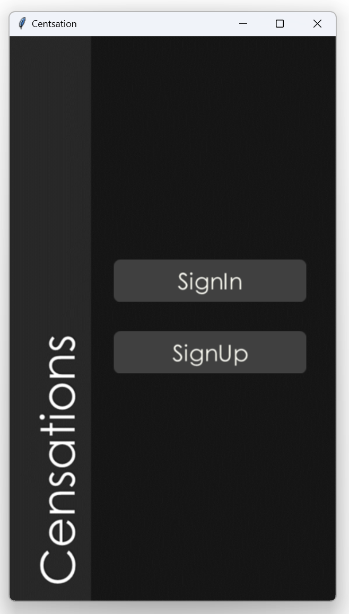
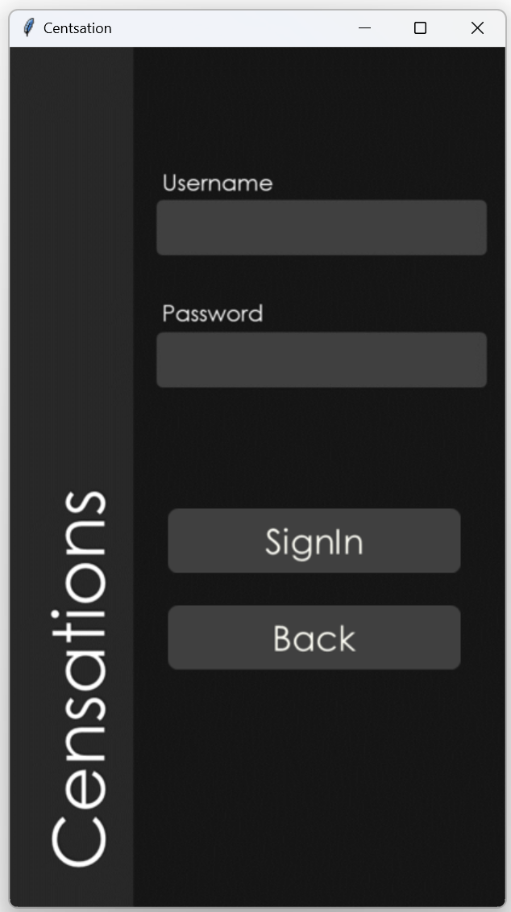
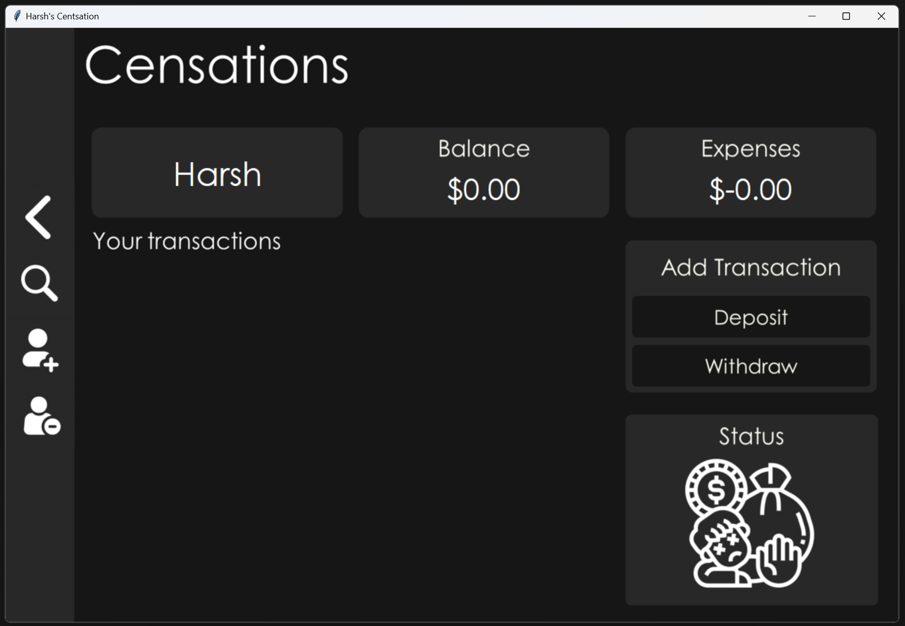

# Centsation: Personal Finance Tracker

## 📝 Overview

Centsation is a desktop application designed to help users track their personal finances efficiently. Built with Python and MySQL, this application provides a user-friendly interface for managing income, expenses, and financial records.

## ✨ Features

- **User Authentication**: Secure login and signup system
- **Income Tracking**: Add and manage deposit entries
- **Expense Tracking**: Record and monitor withdrawal entries
- **Search Functionality**: Advanced search options for financial entries
- **Financial Status Indicators**: Visual cues about your financial health
- **Entry Management**: Edit and delete financial entries
- **User Account Management**: Add or delete user accounts

## 🛠️ Technologies Used

- **Language**: Python
- **GUI Framework**: Tkinter
- **Database**: MySQL
- **Libraries**: 
  - `mysql-connector-python`
  - `pillow` (PIL)
  - `datetime`

## 📦 Prerequisites

- Python 3.x
- MySQL Server
- Required Python packages:
  ```
  pip install mysql-connector-python pillow
  ```

## 🚀 Installation

1. Clone the repository:
   ```
   git clone https://github.com/yourusername/Centsation.git
   ```

2. Install dependencies:
   ```
   pip install -r requirements.txt
   ```

3. Set up MySQL:
   - Ensure MySQL server is running
   - Create a MySQL user with appropriate permissions

## 🔧 Configuration

- Modify database connection parameters in the script:
  ```python
  db = mysql.connector.connect(
      host="localhost",
      user="root",
      password="your_password",
      database="Centsation"
  )
  ```

## 💻 How to Run

```
python centsation.py
```

## 🖼️ Screenshots
1. **SignIn/ SignUp page**  
     
   SignIn/ SignUp page

2. **SignIn page**  
     
   SignIn page

2. **Home page (For new User)**
    

## 🔍 Usage Guide

1. **Sign Up/Login**
   - Create a new account or log in to an existing one
   - Each user has a separate financial record

2. **Dashboard**
   - View total balance
   - See expense summary
   - Check financial status indicator

3. **Add Entries**
   - Use 'Deposit' to record income
   - Use 'Withdraw' to log expenses
   - Optional date and description fields

4. **Search Entries**
   - Filter entries by description
   - Set amount range
   - Search by date

## 🤝 Contributing

1. Fork the repository
2. Create your feature branch (`git checkout -b feature/AmazingFeature`)
3. Commit your changes (`git commit -m 'Add some AmazingFeature'`)
4. Push to the branch (`git push origin feature/AmazingFeature`)
5. Open a Pull Request


## 📞 Contact

Your Name - harshp3304@gmail.com

Project Link: [https://github.com/Harsh3304/Centsation](https://github.com/Harsh3304/Centsation)